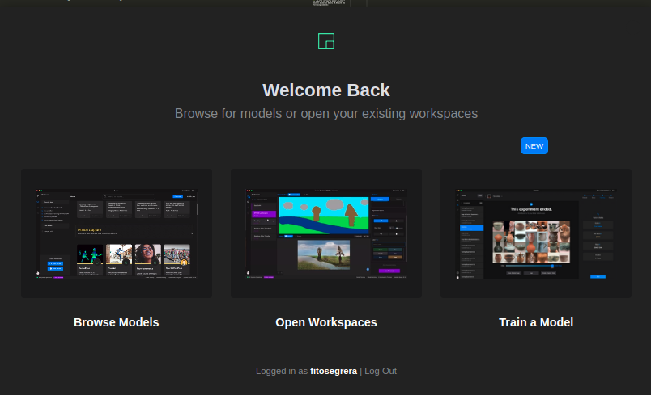
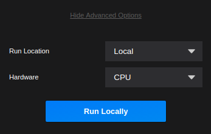
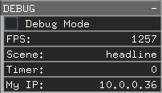

# A&T@2020: UNKNOWN (remote-server, local-server, newsHeadlinesApp)

This README file contains the instructions on how to setup and run the distributed system behind the art installation titled **UNKNOWN** by the chinese artist [**Yin Xiuzhen**](https://en.wikipedia.org/wiki/Yin_Xiuzhen). These 3 APPs are not the complete system. Other parts were developed by different members of the team. All APPs in this manual have been developed on Ubuntu Linux 20.04 LTS. It is strongly recommended to use the same version of Linux on the devices you will use to run this system.

**Author of the code: [Fito Segrera](https://www.fii.to/)**

## Table of contents:

- [remote-server](#remote-server)
  - [Required](#Required)
  - [Installing](#Installing)
  - [Errors](#Errors)
- [local-server](#local-server)
  - [Requirements](#Requirements)
  - [Installation](#Installation)
- [newsHeadlinesApp](#newsHeadlinesAPP)
  - [OpenFrameworks](#OpenFrameworks)
  - [Addons](#Addons)
  - [Setup](#Setup)
- [Running The System](#Run-The-System)
- [Configuration](#Configuration)
- [Stop and Shutdown](#Stop-And-Shutdown)

# remote-server

Because of internet restrictions and regulations in mainland China, the remote-server APP has been created with the only purpose of bridging the local-server APP with the news API and Amazon Translation API. We are currently using Alibaba Cloud services to host the remote-server APP. Please ask the system's Administrator for the url, login and password of this server.

## Required

- Ubuntu Server
- Node JS

A linux server is required, UBUNTU-server is preferred. You need the SSH credentials in order to access this server. Once you have the credentials, you can login through a unix terminal using the following command (assuming your ip is 47.57.78.73):

        ssh root@47.57.78.73

When prompted please type your root password.

## Installing

1.  Install nodeJs on the server. Please first login to your server using ssh on a terminal and use the following commands:

        sudo apt install nodejs

2.  Then install node package manager:

        sudo apt install npm

3.  Upload the remote-server application to the server. You can compress the folder into a .zip and use the "scp" command to upload the file. Or just download a remote file manager like [filezilla](https://filezilla-project.org/) and make it simple.

4.  Once you have the zip file on your server, unzip it and cd into the directory:

        unzip remote-server.zip
        cd remote-server/

**IMPORTANT NOTICE:** In case the uzip command tool is not installed on your server, please do so with:

        sudo apt install unzip

5.  Install all nodeJs dependencies:

        npm install

6.  Install Forever JS:

        npm install -g forever

7.  Run the server using forever:

        forever start server.js

**IMPORTANT NOTICE:** After running the remote-server using the "forever" command, there is no need to run it again.

## Errors

In case your server's port is blocked by default and your nodejs APP is not accessible from the web, please read: How to configure ubuntu server to access a nodejs app in port 3000 remotely [TUTORIAL](https://www.codementor.io/@tomgeraghty/hosting-an-express-server-nodejs-application-with-linode-e1j7wt7mr)

# local-server

The local-server is a nodeJS application which controls and monitors the entire system.

## Requirements

- Ubuntu Linux PC (we use an INTEL NUC PC)
- NodeJs
- Runwayml

## Installation

Please find bellow a step-by-step guide on how to install the different parts needed to run the local-server APP.

### **1. Node JS**

1.  Install nodeJs on the local machine using the following command:

        sudo apt install nodejs

2.  Then install node package manager:

        sudo apt install npm

3.  You can check if all was installed correctly:

        node --version

        npm -- version

### **2. Runwayml**

Runwayml is a visual interface framework designed for creative use of Machine Learning. More information of this project [HERE](https://runwayml.com/).

1.  Download and install Runway ML from this [LINK](https://runwayml.com/)

2.  Run Runway ML and log in with the credentials provided (ASK FITO).

3.  Choose the option "browse models" and search for "AttnGAN Text To Image Generation".

4.  When prompted, create a new workspace with the name **_UNKNOWN_**

5.  Within the new workspace screen search for the _advanced options_ on the bottom right corner on top of the red run model button. Change the _Run Location_ from _Remote_ to _Local_.

6.  Now you might see a message saying docker is not available. If so please refer to **step 7**.

7.  We need to install docker in Ubuntu in order to run the AI model locally. Install docker on Ubuntu 20.04 with the following commands:

        sudo apt remove docker docker-engine docker.io containerd runc

        curl -fsSL https://download.docker.com/linux/ubuntu/gpg | sudo apt-key add -

        sudo add-apt-repository "deb [arch=amd64] https://download.docker.com/linux/ubuntu eoan stable"

        sudo apt update && sudo apt install docker-ce docker-ce-cli containerd.io

**(OPTIONAL)** More detailed instructions HERE](https://computingforgeeks.com/how-to-install-docker-on-ubuntu/). Notice we have changed the line:

        sudo add-apt-repository "deb [arch=amd64] https://download.docker.com/linux/ubuntu bionic stable stable"

For:

        sudo add-apt-repository "deb [arch=amd64] https://download.docker.com/linux/ubuntu eoan stable"

This is because at the time of developing this project, docker didn't yet release the version for ubuntu 20.02 "focal" so we installed the previous version "eoan". More details on the fix [HERE](https://forums.docker.com/t/cant-install-docker-on-ubuntu-20-04/93058/3)

8.  To create the docker group and add your user:

        sudo groupadd docker

9.  Add your user to the docker group.

        sudo usermod -aG docker \$USER

10. Log out and log back in so that your group membership is re-evaluated. On Linux, you can also run the following command to activate the changes to groups:

        newgrp docker

11. Verify that you can run docker commands without sudo.

        docker run hello-world

If you need more information check out the official docker documentation: [LINK](https://docs.docker.com/install/linux/linux-postinstall/)

**Important Note:** If after doing the steps described above Runways still can't detect docker, please reboot the machine and try again.

# newsHeadlinesAPP

This application runs on 5 Lattepandas mini-pcs with Ubuntu 20.04 LTS. They are all networked through the [local-server](#local-server) APP which distributes the entire system.

## OpenFrameworks

Built and tested with openframeworks (of_v0.11.0_linux64gcc6_release) running on UBUNTU 20.04 LTS. Instructions on how to install openframeworks [HERE](https://openframeworks.cc/download/)

**IMPORTANT NOTICE:** We strongly suggest to use the same version of OpenFrameworks.

## Addons

- ofxGui (included with the used version of openframeworks)
- ofxOsc (included with the used version of openframeworks)
- ofxAssimpModelLoader (included with the used version of openframeworks)
- ofxTrueTypeFontUC -> [GITHUB](https://github.com/hironishihara/ofxTrueTypeFontUC)

**IMPORTANT NOTE:** The original ofxTrueTypeFontUC library was giving errors when compiled. The problem was fixed by adding the line: #include "ofMain.h" to the header file (ofxTrueTypeFontUC.h). Please, **_if you need to compile this application from source_**, make sure you do the #include on top of all other #includes (it should be the first). You can also just find the modified version in the following path:

      		/libraries_backup/ofxTrueTypeFontUC

## Setup

This instructions assume you are setting this app up on a device running ubuntu 20.04. Be mindful that you have to replace vX_X with whatever version of the app you re working with, ei. newsHeadlinesApp_v0_8

1.  Move the newsHeadlinesApp_vX_X to your desired location. We recommend the Desktop or home directory.

2.  If you want to test the APP please open a terminal and cd into the /bin directory within the /newsHeadlinesApp_vX_X folder.

        cd newsHeadlinesApp_vX_X/bin/

3.  Finally execute the binary file:

        ./newsHeadlinesApp_vX_X

# Run-The-System

This is a complex system with many parts. Please follow the next steps mindfully.

### **remote-server**

The remote-server should be running permanently by now using the "forever" command. If you are not sure if you did this correctly please refer to the [remote-server](#remote-server) section of this manual.

### **local-server**

1. In the local machine (we use an INTEL NUC mini PC) run runwayml and our text to image machine learning model. Please search for runwayml on your local machine and run it.

2. Once runwayml loads you will see the following splash screen:

3. Click on **_Open Workspaces_**. You will see the workspace you created called _UNKNOWN_.

4. You should see a blue button on the bottom right corner with the label _Run Locally_. Make sure the _Hardware_ is set to _CPU_. Now run the model. Most of the time it takes a few seconds to run, but it might take up to a few minutes some times.

5.  Now open a terminal and cd to the local-server folder.

        cd local-server/

6.  Run the server:

        node server.js

7.  Open Google Chrome Browser got to the url [http://localhost:4000](http://localhost:4000)

A graphic user interface (GUI) should load on your browser.

If the remote server and runwayml are running correctly you should be able to see a **START** button pop up on the lower right corner of the "console-style" window of the GUI. Press this button and the system will download and process the DATA.

If the **START** button does not appear, this means that probably one of the servers or runwayml are not running. Please check.

### **newsHeadlinesApp**

This Application runs on the lattepanda alpha mini PC. Before running this APP we need to make sure the emotions (face recognition) APP is running.

**IMPORTANT NOTICE:** This emotion recognition APP is not included in this repository. Please contact the System's Administrator for further details or visit the repository of the emotion recognition APP [HERE]().

1.  Once the emotion recognition APP is running go to your newsHeadlinesApp /bin folder using a terminal:

        cd newsHeadlinesApp_vX_X/bin/

2.  Run the binary file:

        ./newsHeadlinesApp_vX_X

# Configuration

After running our system we need to make sure that all APPs are running properly and that all IP addresses and PORTS are correct.

### **local-server**

When you run the local server and open Google Chrome Browser on the address [http://localhost:4000](http://localhost:4000) you will see the following **GUI**:

**The 3 indicators on the top**, namely local-server, remote-server and runwayml-(AI) have a green/red circle next to them to indicate their status. Green means connected, red means disconnected.If any of these shows red, please refer to the [Run](#Run) section of this manual.

The **START BUTTON** only appears once the 3 indicators on the top are green. When pressed, this button disappears. You will see the data being requested and the status of the request and other details prompted on the console view. After the you press this button the system will do auto-requests every given amount of time which you can define on the **Auto-request time (hrs)** text box next to the **START** button.

The **Auto-request time (hrs)** text box takes in the number of hours between each automatic data request. This time will start counting after the START button is pressed. Please make sure you press the save button at the bottom of the GUI for the changes to take place and for the new value to be saved on the system. We strongly suggest to refresh the page after changing and saving this value. **IMPORTANT NOTE:** The NEWS API that we use in this system updates their TOP news every certain amount of time. Unfortunately this time is not indicated in their documentation. We recommend to set the **Auto-request time (hrs)** value over 3 hours.

The **SCREENS THUMBNAILS** with the labels: Screen 1, Screen 2, etc. indicate the status of the newsHeadlinesApps running on the lattePandas mini PCs. When connected, a thumbnail of the AI image that will be rendered on each screen will be displayed and the indicator will be green. Please notice that, due to a slow ping mechanism, there might be a delay between the moment when the newsHeadlinesApp runs and the thumbnail appears on the GUI.

The **IP & PORTS** text boxes at the bottom allow you to change the addresses and ports of the different newsHeadlinesApp machines. Please make sure that you press the save button after changing the IPs or PORTs values for any of the screens. As a user-friendly measure, if the IP address you input is wrong, you will see a message suggesting you the correct IP address on top of the address box and bellow the SCREEN THUMBNAIL box.

### **newsHeadlinesApp**

A configuration GUI has been added to the APP. In order to bring up the configuration interface please press the letter 's' on the keyboard.

1.  The save icon located at the right of the top SETTINGS bar is used to save any changes done to the APP through this GUI. **WARNING:** Changes cannot be undone after saving. All saved settings are kept on a local file:

        newsHeadlinesApp_vX_X/bin/data/settings.xml

2.  The load icon (located at the left of the save icon) enables the user to load any previous settings before the "save" icon is pressed.

3.  **GENERAL** tab:

    

    - _PC ID :_ (string) Each screen running this APP should have an ID value. Please change this value on each screen and save the settings accordingly. **VERY IMPORTANT:** The first machine should have a _PC ID_ value of 1 and the others should follow sequentially. Assuming you have 5 NEWS HEADLINES PCs then you will have the following ID values: 1, 2, 3, 4, 5.

    - _Init Language Chinese_ : (boolean) value to tell the application to start or not with Chinese data. False means the application starts with English Language.

    - _Background Color_ : (ofColor) Background color of the entire APP.

    - _Margin X & Margin Y_ : (int) This are the rendering margins for all TEXTS in the APPlication. It does not apply to the image scene which renders edge to edge.

4.  **HEADLINES** tab:

    

    - _Font Size_ : (int) Headlines font size.

    - _Margin Fix_ : (float) correct error that happens when a character from the headline is rendered outside of the right margin of the screen. **IMPORTANT NOTE:** Applies to chinese ONLY!

    - _Auto Correct -_ : (bool) auto correct function which tries to remove the " - news source" at the end of each headline. The function also removes all extra white spaces.

      **WARNING:** this is an experimental approach, unexpected results might happen due to potential rare uses of the dash character, on the side of the news source. Examples:

      Original: "Trump pushes fights over - racist - legacy while much of America moves in a different direction - The Washington Post"

      Auto Correct: "Trump pushes fights over racist legacy while much of America moves in a different direction"

      Original: "Third-world countries struggle as Covid-19 death-tolls rise - The New York Times"

      Auto Correct: "Third-world countries struggle as Covid-19 death-tolls rise"

    - _Headline Color_ : (ofColor) Color of the headline text.

    - _Time-Limit_ : (int) The time in seconds for the headline to be displayed.

5.  **IMAGE RENDERING** tab:

    

    - _Remaining Passes_ : (int) Displays the number of passes left to render during the image rendering process. (It is a READ ONLY setting, cannot be modified).

    - _Max Passes_ : (int) Maximum passes for the render engine. On the latte panda between 400 and 500 have shown a good speed vs quality result at FULL HD. The lower this value the faster the image is rendered but less sharpness.

    - _Max Range_ : (int) The maximum amount of pixels to be rendered in a single render pass.

    - _Pixel Size Min_ : (int) The smallest pixel size to be rendered.

    - _Pixel Size Max_ : (int) The biggest pixel size to be rendered.

    - _Range Increment_ : (float) The exponential increment factor of the renderer. The higher this value the faster the image is rendered.

6.  **EMOTIONS** tab:

    

    - _Font Size_ : (int) Size of the displayed Text during the emotions data scene.

    - _Text Color_ : (ofColor) Color of the displayed text.

    - _Paragraph Space_ : (int) Space between paragraphs.

    - _Object Size_ : (float) Sizeof 3D model.

    - _Camera Distance_ : (int) Distance from the camera to the 3D model.

    - _Time Limit_ : (int) Time in seconds for the duration of this scene.

    - _Data Path_ : (string) Path where the emotions.json file is saved. **IMPORTANT NOTE:** If you hover the mouse over this panel it will display the default path. Please don't change unless you move the location of this file.

7.  **OSC** tab:

    

    This section is divided into 4 sub-sections:

    - _OSC RECEIVER_ : (string) Here you can change the PORT of all incoming messages.

    - _OSC HEADLINE SENDER_ : (string) Here you can change the IP address, PORT and Timeout for the communication with the headline local server. The timeout determines how many seconds pass before another connection attempt happens. This is just in case the headline server is offline.

    - _OSC EMOTIONS SENDER_ : (string) Here you can change the IP address, PORT and Timeout for the communication with the emotions APP. The timeout determines how many seconds pass before another connection attempt happens. This is just in case the emotions APP is offline.

    - _OSC GALAXY SENDER_ : (string) Here you can change the IP address and PORT for the communication with the GALAXY rendering PC.

8.  **DEBUG** tab:

    

    - _Debug Mode_ : (boolean) Turns ON and OFF the Debug Mode which allows you to see margins, coordinates, spaces, text bounding boxes, OSC data, etc.

    - _OSC Debug Console_ : (boolean) Turns ON and OFF a terminal/console which shows incoming and outgoing OSC messages.

    - _FPS_ : (READ-ONLY) Framerate of the APP.

    - _Scene_ : (READ-ONLY) Display the current scene (headline, image, emotions).

    - _Timer_ : (READ-ONLY) The remaining time of the current scene.

    - _My IP_ : (READ-ONLY) The IP address of the local machine.

## Auto run at BOOT

Some of these APPS can be setup to run at boot. We strongly suggest to do so with the local-server APP and the newsHeadlinesAPP. Unfortunately this is not possible with runwayml.

In order to set up these APPs to run at BOOT you might want to see the following [DISCUSSION](https://unix.stackexchange.com/questions/441624/how-to-start-node-js-app-on-machine-boot-by-creating-a-boot-service)

# Stop-And-Shutdown

1. We have added a shutdown button on the **local-server GUI**. By pressing this button a signal will be sent to all NEWS HEADLINES PCs and these will be shutdown remotely.

2. After pressing this button you might want to go and manually turn OFF the screens for the NEWS HEADLINES PCs.

3. Now manually stop runwayml's model by clicking on the RED BUTTON called "Stop Model" located on the bottom right corner of the UNKNOWN Workspace. If you can't remember where to find this button, please refer to the [Run](#Run-The-System) section of this manual.

4. Shut down the local-server PC normally.
